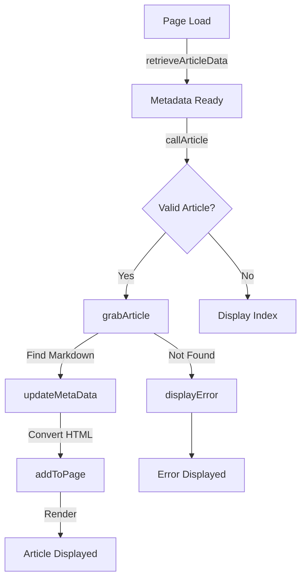

# ArticleFiller Class API Reference

The `ArticleFiller` class is the core module responsible for managing article data, rendering content, and handling navigation in Small Dev Talk.

**Location:** [src/scripts/index.js](../../src/scripts/index.js)

**Type:** Singleton class (static methods only)

**Dependencies:** Showdown.js, Sentry, fetch API

## Overview

ArticleFiller is a utility class that:

- Fetches and caches article metadata from JSON
- Loads article markdown content dynamically
- Converts markdown to HTML using Showdown
- Updates page metadata (title, description, image)
- Handles errors and displays user-friendly messages
- Manages UI state and navigation

**Key Pattern:** All methods are static, creating a singleton-like interface. State is maintained in class properties.

## State Properties

ArticleFiller maintains these static class properties:

```javascript
ArticleFiller.articleData = {}; // All article metadata
ArticleFiller.articleMd = ""; // Raw markdown of current article
ArticleFiller.article = ""; // Rendered HTML content
ArticleFiller.whatPageDisplay = ""; // Current view state
ArticleFiller.errMsg = ""; // Error message for display
```

## Methods

### `retrieveArticleData()`

Fetches and caches the article metadata registry.

**Signature:**

```javascript
static retrieveArticleData() // No parameters
```

**Behavior:**

1. Fetches JSON from `/src/articleArchive/articleData.json`
2. Stores result in `ArticleFiller.articleData`
3. Logs to console for debugging
4. Called once on page load (see [index.html](../../index.html) `onload` event)

**Example:**

```javascript
ArticleFiller.retrieveArticleData();
console.log(ArticleFiller.articleData);
// { "Playsets": {...}, "Caravaneer2": {...}, ... }
```

**Error Handling:** If fetch fails, error is logged to Sentry.

### `callArticle()`

Determines what content to display based on URL query parameters.

**Signature:**

```javascript
static callArticle() // No parameters
```

**Behavior:**

1. Parses `document.URL` for query parameters
2. Extracts article name from URL (e.g., `/?ArticleName`)
3. Routes to appropriate display:
    - Query parameter matches article: Load article
    - No query parameter: Display index/landing page
    - Invalid article name: Display error

**URL Examples:**

- `https://smalldevtalk.net/?Playsets` → Load "Playsets" article
- `https://smalldevtalk.net/?Caravaneer2` → Load "Caravaneer 2" article
- `https://smalldevtalk.net/` → Display index page

**Called by:** Page load (via `onload` in index.html)

### `grabArticle(articleName)`

Loads a specific article from the archive.

**Signature:**

```javascript
static grabArticle(articleName) // Parameter: string
```

**Parameters:**

- `articleName` (string) — Article key matching `articleData.json` key

**Behavior:**

1. Normalizes article name (removes spaces, applies capitalization)
2. Checks if article exists in `ArticleFiller.articleData`
3. Fetches markdown file from `/src/articleArchive/author.../{articleName}/`
4. Converts markdown to HTML via Showdown
5. Updates page title and metadata
6. Renders HTML to page

**Example:**

```javascript
ArticleFiller.grabArticle("Playsets");
// Loads and renders the Playsets article
```

**Error Handling:**

- If article not found: displays error via `displayError()`
- If markdown file missing: shows 404 error
- If markdown parsing fails: shows parsing error

### `updateMetaData(articleData, articleKey)`

Updates HTML `<meta>` tags for SEO and social sharing.

**Signature:**

```javascript
static updateMetaData(articleData, articleKey) // Parameters: Object, string
```

**Parameters:**

- `articleData` (Object) — Metadata object from articleData.json
    - `title` — Article title
    - `summary` — Brief description
    - `author` — Author name
    - `date` — Publication date (YYYY-MM-DD)
    - `thumbnail` — Image filename
- `articleKey` (string) — Article ID from URL

**Updated Meta Tags:**

```javascript
document.title = articleData.title;
// <meta name="description" content="...">
// <meta property="og:title" content="...">
// <meta property="og:description" content="...">
// <meta property="og:image" content="...">
// <meta name="twitter:title" content="...">
// <meta name="twitter:description" content="...">
// <meta name="twitter:image" content="...">
```

**Called by:** `grabArticle()` after loading article content

### `addToPage()`

Renders article HTML to the page.

**Signature:**

```javascript
static addToPage() // No parameters
```

**Behavior:**

1. Converts markdown to HTML using Showdown
2. Inserts HTML into page DOM
3. Updates page state (`whatPageDisplay`)
4. Logs to Sentry for monitoring

**Called by:** `grabArticle()` after metadata update

### `displayError(msg)`

Shows error messages to users.

**Signature:**

```javascript
static displayError(msg) // Parameter: string
```

**Parameters:**

- `msg` (string) — Error message to display

**Behavior:**

1. Logs error to console
2. Sends error to Sentry
3. Displays user-friendly error UI
4. Stores error message in `ArticleFiller.errMsg`

**Example:**

```javascript
ArticleFiller.displayError("Article not found");
```

## State Diagram

ArticleFiller transitions through these states:



## Usage Examples

### Load Article on Page Load

```javascript
// Called by index.html onload event
ArticleFiller.retrieveArticleData();
ArticleFiller.callArticle();
```

### Programmatically Load Article

```javascript
ArticleFiller.grabArticle("Playsets");
// Article content now rendered to page
```

### Handle Errors

```javascript
try {
	ArticleFiller.grabArticle("InvalidArticle");
} catch (error) {
	ArticleFiller.displayError(`Failed to load article: ${error.message}`);
}
```
