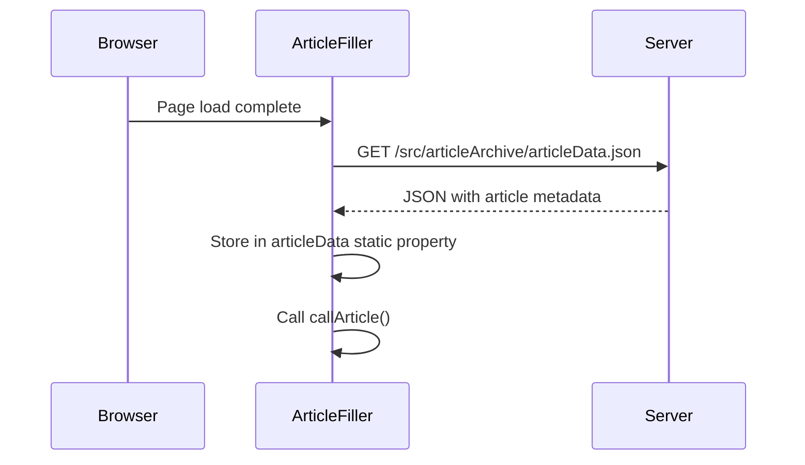
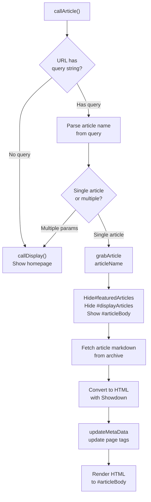
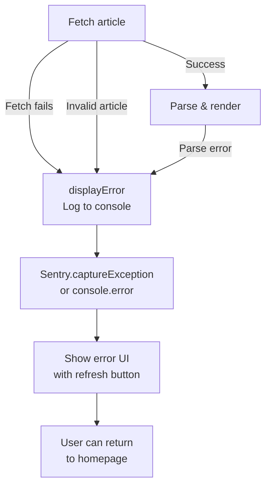
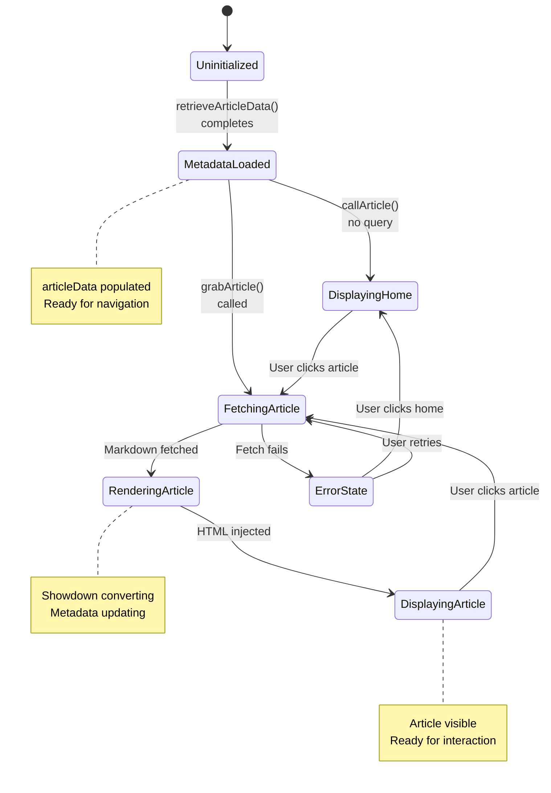

# Data Flow Diagram

This document illustrates how data flows through Small Dev Talk from initial page load to rendered article.

## Complete Data Flow

```mermaid
flowchart TD
    subgraph Request["User Request"]
        A1["User visits index.html<br/>or clicks article link"]
        A2["URL contains query parameter<br/>?ArticleName"]
    end

    subgraph Init["Initialization"]
        B1["Scripts load:<br/>jQuery, Showdown,<br/>Bootstrap, Sentry"]
        B2["Sentry error tracking<br/>is configured"]
        B3["Service worker<br/>registers if offline<br/>caching enabled"]
    end

    subgraph Metadata["Load Metadata"]
        C1["ArticleFiller.retrieveArticleData()<br/>called"]
        C2["Fetch /src/articleArchive/<br/>articleData.json"]
        C3["Store JSON in memory<br/>ArticleFiller.articleData"]
    end

    subgraph Decision["Process URL & Decide"]
        D1["ArticleFiller.callArticle()<br/>parses URL query"]
        D2{"Article Name<br/>requested?"}
        D3["Show homepage<br/>with grid"]
        D4["Load single article"]
    end

    subgraph Fetch["Fetch Article Content"]
        E1["Construct article path:<br/>authorAuthorName/<br/>YYYY-MM-DD_Title/<br/>Title.md"]
        E2["Fetch markdown file<br/>from CDN or cache"]
        E3["Store raw markdown<br/>ArticleFiller.articleMd"]
    end

    subgraph Meta["Update Page Metadata"]
        F1["ArticleFiller.updateMetaData()<br/>updates page tags"]
        F2["Document.title<br/>og:title<br/>og:description<br/>og:image"]
        F3["Structured data<br/>application/ld+json"]
    end

    subgraph Render["Render HTML"]
        G1["Showdown.Converter<br/>converts markdown → HTML"]
        G2["Store rendered HTML<br/>ArticleFiller.article"]
        G3["Inject HTML into<br/>#articleBody"]
        G4["Remove #featuredArticles<br/>and #displayArticles"]
    end

    subgraph Cache["Cache & Service Worker"]
        H1["Service Worker<br/>precaches article assets"]
        H2["Images, CSS, JS<br/>stored in cache"]
        H3["Subsequent visits<br/>load from cache first"]
    end

    subgraph Monitor["Error Tracking"]
        I1["Sentry monitors for<br/>fetch errors"]
        I2["Console errors logged<br/>via enableLogs: true"]
        I3["Network errors reported<br/>with context"]
    end

    subgraph Display["Display to User"]
        J1["Rendered article<br/>visible in browser"]
        J2["Images lazy-load<br/>from article directory"]
        J3["Bootstrap styling<br/>applied"]
    end

    A1 --> A2
    A2 --> B1
    B1 --> B2
    B2 --> B3
    B3 --> C1
    C1 --> C2
    C2 --> C3
    C3 --> D1
    D1 --> D2
    D2 -->|No| D3
    D2 -->|Yes| D4
    D4 --> E1
    E1 --> E2
    E2 --> E3
    E3 --> F1
    F1 --> F2
    F2 --> F3
    F3 --> G1
    G1 --> G2
    G2 --> G3
    G3 --> H1
    G3 --> I1
    H1 --> H2
    H2 --> H3
    I1 --> I2
    I2 --> I3
    G3 --> J1
    J1 --> J2
    J2 --> J3
```



## Component Interactions

### 1. Bootstrap & Resource Loading

When [index.html](../../index.html) loads:

1. HTML is parsed
2. External scripts and stylesheets are downloaded:
    - Bootstrap CSS (from CDN)
    - jQuery (from CDN)
    - Showdown.js (from CDN)
    - Sentry SDK (from sentry-cdn.com)
    - Custom [index.js](../../src/scripts/index.js) (local)

3. Inline `<script>` block initializes:
    - `Sentry.init()` with configuration
    - `Sentry.configureScope()` with user context
    - `ArticleFiller.retrieveArticleData()` to start loading metadata

### 2. Article Data Retrieval



### 3. Article Loading Logic

The `callArticle()` method determines what to display:



### 4. Error Handling Flow



### 5. Metadata Update Sequence

When an article loads, the following metadata is dynamically updated:

```javascript
// 1. Document title
document.title = `${articleData.title} | Small Dev Talk`

// 2. Open Graph tags
og:title → article title
og:description → article summary
og:image → article thumbnail

// 3. Twitter Card tags
twitter:title → article title
twitter:description → article summary
twitter:image → article thumbnail

// 4. Structured data (Schema.org)
{
  "@type": "NewsArticle",
  "headline": article title,
  "description": article summary,
  "image": article thumbnail,
  "author": article author,
  "datePublished": article date
}
```

## State Transitions

ArticleFiller maintains state through static properties:



---

See also:

- [System Architecture](./system.md)
- [Dependencies & Integrations](./dependencies.md)
- [ArticleFiller API](../api/article-filler.md)
