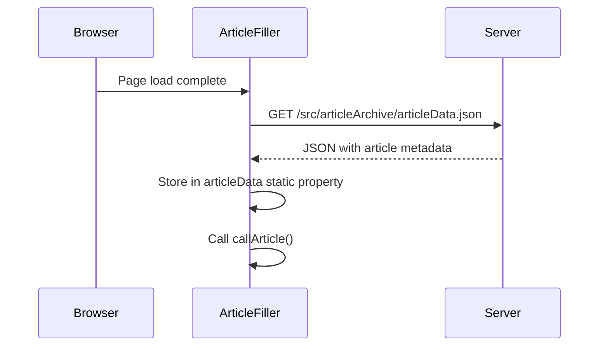
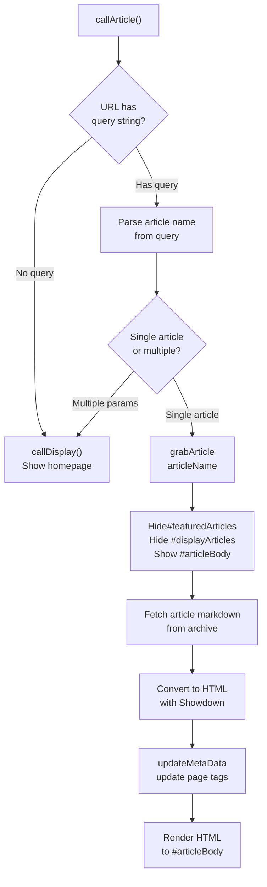
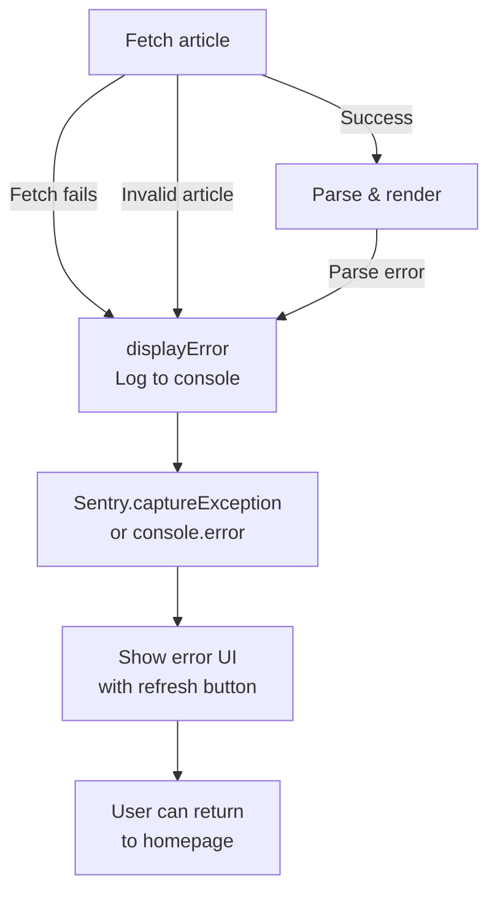
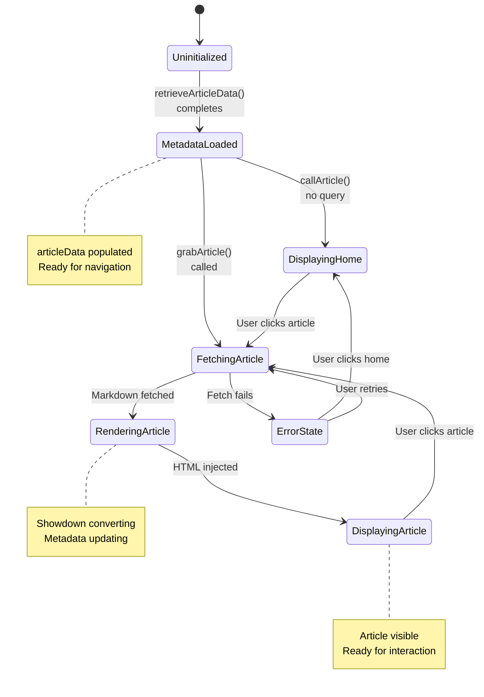

# Data Flow Diagram

This document illustrates how data flows through Small Dev Talk from initial page load to rendered article.

## Complete Data Flow


```mermaid
flowchart TD
    accTitle: Complete data flow from page load to rendered article
    accDescr: A user request triggers script loading and Sentry initialization, service worker registration, article metadata fetch, a URL decision between homepage and single article, article content fetch, page metadata update, Showdown Markdown to HTML rendering, caching, error tracking, and final display to the user.
    subgraph Request["User Request"]
        A1["User visits index.html<br/>or clicks article link"]
        A2["URL contains query parameter<br/>?ArticleName"]
    end

    subgraph Init["Initialization"]
        B1["Scripts load:<br/>jQuery, Showdown,<br/>Bootstrap, Sentry"]
        B2["Sentry error tracking<br/>is configured"]
        B3["Service worker registers<br/>if the browser<br/>supports it"]
    end

    subgraph Metadata["Load Metadata"]
        C1["ArticleFiller.retrieveArticleData()<br/>called"]
        C2["Fetch /src/articleArchive/<br/>articleData.json"]
        C3["Store JSON in memory<br/>ArticleFiller.articleData"]
    end

    subgraph Decision["Process URL & Decide"]
        D1["ArticleFiller.callArticle()<br/>parses URL query"]
        D2{"Article Name<br/>requested?"}
        D3["Show homepage<br/>with grid"]
        D4["Load single article"]
    end

    subgraph Fetch["Fetch Article Content"]
        E1["Construct article path:<br/>authorAuthorName/<br/>YYYY-MM-DD_Title/<br/>Title.md"]
        E2["Fetch markdown file<br/>from site origin<br/>or service worker cache"]
        E3["Store raw markdown<br/>ArticleFiller.articleMd"]
    end

    subgraph Meta["Update Page Metadata"]
        F1["ArticleFiller.updateMetaData()<br/>updates page tags"]
        F2["Document.title<br/>og:title<br/>og:description<br/>og:image"]
        F3["Structured data<br/>application/ld+json"]
    end

    subgraph Render["Render HTML"]
        G1["Showdown.Converter<br/>converts markdown → HTML"]
        G2["Store rendered HTML<br/>ArticleFiller.article"]
        G3["Inject HTML into<br/>#articleBody"]
        G4["Remove #featuredArticles<br/>and #displayArticles"]
    end

    subgraph Cache["Cache & Service Worker"]
        H1["Service Worker<br/>precaches article assets"]
        H2["Images, CSS, JS<br/>stored in cache"]
        H3["Subsequent visits<br/>load from cache first"]
    end

    subgraph Monitor["Error Tracking"]
        I1["Sentry monitors for<br/>fetch errors"]
        I2["Console errors logged<br/>via enableLogs: true"]
        I3["Network errors reported<br/>with context"]
    end

    subgraph Display["Display to User"]
        J1["Rendered article<br/>visible in browser"]
        J2["Images lazy-load<br/>from article directory"]
        J3["Bootstrap styling<br/>applied"]
    end

    A1 --> A2
    A2 --> B1
    B1 --> B2
    B2 --> B3
    B3 --> C1
    C1 --> C2
    C2 --> C3
    C3 --> D1
    D1 --> D2
    D2 -->|No| D3
    D2 -->|Yes| D4
    D4 --> E1
    E1 --> E2
    E2 --> E3
    E3 --> F1
    F1 --> F2
    F2 --> F3
    F3 --> G1
    G1 --> G2
    G2 --> G3
    G3 --> H1
    G3 --> I1
    H1 --> H2
    H2 --> H3
    I1 --> I2
    I2 --> I3
    G3 --> J1
    J1 --> J2
    J2 --> J3
```

## Component Interactions

### 1. Bootstrap & Resource Loading

When [index.html](../../index.html) loads:

1. HTML is parsed
2. Scripts and stylesheets are downloaded. Everything except Sentry is served from this repository rather than a content delivery network (CDN):
    - `style.min.css` and the Bootstrap stylesheet, both under the site root
    - jQuery, the Bootstrap JavaScript bundle, and Showdown.js, all under `src/scripts/libraries/`
    - `src/scripts/index.min.js`, the minified build of [index.js](../../src/scripts/index.js)
    - Sentry SDK, the one remote dependency, from `js.sentry-cdn.com` and `browser.sentry-cdn.com`

3. Inline `<script>` blocks initialize:
    - `Sentry.init()` with configuration
    - `Sentry.configureScope()` with the `app-version` tag
    - Google Tag Manager, and a canonical URL adjustment applied only on the `smalldevtalk.net` host

Metadata loading starts from [index.js](../../src/scripts/index.js) rather than from the inline blocks. That file assigns `window.onload`, which awaits `registerServiceWorker()` and then calls `init()`; `init()` calls `retrievePageData()` followed by `retrieveArticleData()`.

### 2. Article Data Retrieval


```mermaid
sequenceDiagram
    accTitle: Article data retrieval sequence
    accDescr: After the browser completes loading, ArticleFiller fetches articleData.json from /src/articleArchive/, stores it in the articleData static property, then calls callArticle().
    participant Browser
    participant AF as ArticleFiller
    participant Server

    Browser->>AF: Page load complete
    AF->>Server: GET /src/articleArchive/articleData.json
    Server-->>AF: JSON with article metadata
    AF->>AF: Store in articleData static property
    AF->>AF: Call callArticle()
```

### 3. Article Loading Logic

The `callArticle()` method determines what to display:


```mermaid
flowchart TD
    accTitle: Article loading logic in callArticle()
    accDescr: callArticle() checks for a query string. No query or multiple parameters shows the homepage. A single article triggers grabArticle, which hides the featured and display sections, shows articleBody, fetches the Markdown, converts it with Showdown, updates metadata, and renders to articleBody.
    A["callArticle()"] --> B{"URL has<br/>query string?"}
    B -->|No query| C["callDisplay()<br/>Show homepage"]
    B -->|Has query| D["Parse article name<br/>from query"]
    D --> E{"Single article<br/>or multiple?"}
    E -->|Multiple params| C
    E -->|Single article| F["grabArticle<br/>articleName"]
    F --> G["Hide#featuredArticles<br/>Hide #displayArticles<br/>Show #articleBody"]
    G --> H["Fetch article markdown<br/>from archive"]
    H --> I["Convert to HTML<br/>with Showdown"]
    I --> J["updateMetaData<br/>update page tags"]
    J --> K["Render HTML<br/>to #articleBody"]
```

### 4. Error Handling Flow


```mermaid
flowchart TD
    accTitle: Error handling flow
    accDescr: A failed or invalid fetch, or a parse error, calls displayError, which logs to the console and reports to Sentry, then shows an error UI with a refresh button and lets the user return to the homepage.
    A["Fetch article"] -->|Success| B["Parse & render"]
    A -->|Fetch fails| C["displayError<br/>Log to console"]
    A -->|Invalid article| C
    B -->|Parse error| C
    C --> D["Sentry.captureException<br/>or console.error"]
    D --> E["Show error UI<br/>with refresh button"]
    E --> F["User can return<br/>to homepage"]
```

### 5. Metadata Update Sequence

When an article loads, the following metadata is dynamically updated:

```javascript
// 1. Document title
document.title = `${articleData.title} | Small Dev Talk`

// 2. Open Graph tags
og:title → article title
og:description → article summary
og:image → article thumbnail

// 3. Twitter Card tags
twitter:title → article title
twitter:description → article summary
twitter:image → article thumbnail

// 4. Structured data (Schema.org)
// updateMetaData updates only the name, description, and image keys of the
// existing WebSite object; @type is never changed.
{
  "@type": "WebSite",
  "name": article title + " | Small Dev Talk",
  "description": article summary + " | Small Dev Talk",
  "image": article thumbnail URL
}
```

## State Transitions

ArticleFiller maintains state through static properties:


```mermaid
stateDiagram-v2
    accTitle: ArticleFiller state transitions
    accDescr: States move from Uninitialized to MetadataLoaded after retrieveArticleData(), then to DisplayingHome or FetchingArticle, then RenderingArticle and DisplayingArticle. A failed fetch enters ErrorState, with paths back to the homepage or a retry.
    [*] --> Uninitialized
    Uninitialized --> MetadataLoaded: retrieveArticleData()<br/>completes
    MetadataLoaded --> DisplayingHome: callArticle()<br/>no query
    MetadataLoaded --> FetchingArticle: grabArticle()<br/>called
    FetchingArticle --> RenderingArticle: Markdown fetched
    RenderingArticle --> DisplayingArticle: HTML injected
    DisplayingArticle --> FetchingArticle: User clicks article
    DisplayingHome --> FetchingArticle: User clicks article
    FetchingArticle --> ErrorState: Fetch fails
    ErrorState --> DisplayingHome: User clicks home
    ErrorState --> FetchingArticle: User retries

    note right of MetadataLoaded
        articleData populated
        Ready for navigation
    end note

    note right of RenderingArticle
        Showdown converting
        Metadata updating
    end note

    note right of DisplayingArticle
        Article visible
        Ready for interaction
    end note
```

---

See also:

- [System Architecture](./system.md)
- [ArticleFiller API](../api/article-filler.md)
