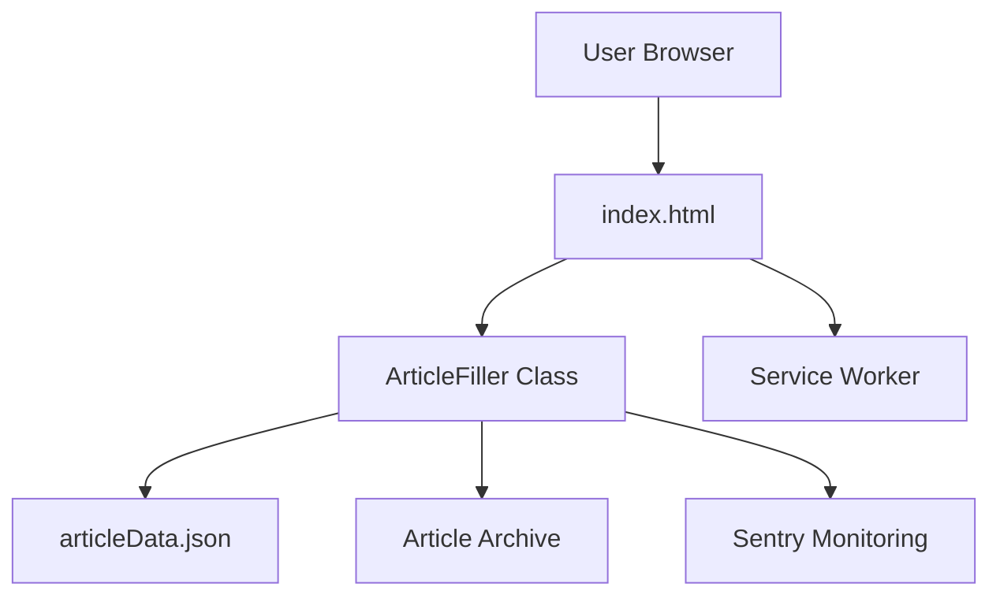

# Architecture Documentation

This section explains the system design, data flows, and architectural decisions that shape Small Dev Talk.

## Overview

The architecture documentation provides a comprehensive understanding of how Small Dev Talk is structured, how components interact, and why specific design decisions were made. This is essential reading for anyone working on the codebase or planning significant changes.

## Available Documentation

### [System Architecture](./system.md)

Complete overview of the system design and component interactions.

**Key Topics:**

- High-level architecture diagram
- Component breakdown (Client Layer, Core Logic, Data Layer, Services)
- ArticleFiller singleton pattern
- Article metadata registry
- Service Worker and caching strategy
- Security and Content Security Policy (CSP)
- Navigation structure
- Technology stack and dependencies

### [Data Flow](./data-flow.md)

Detailed explanation of how data moves through the application from page load to rendered content.

**Key Topics:**

- Complete data flow sequence diagrams
- Page initialization lifecycle
- Article loading process
- Metadata update flow
- Error handling workflows
- Component interaction sequences
- State transitions

## Architectural Principles

Small Dev Talk follows these core architectural principles:

1. **Static-First Architecture** — No server-side processing; all content served as static files
2. **Client-Side Rendering** — Markdown converted to HTML in the browser using Showdown.js
3. **Metadata-Driven** — All articles indexed in a central JSON registry
4. **Progressive Enhancement** — Service Workers provide offline capability
5. **Security-First** — Strict Content Security Policy (CSP) headers
6. **Maintainability** — Project in maintenance mode, focusing on stability over features

## System Diagrams

### High-Level Architecture

### Component Layers

- **Client Layer:** HTML, CSS, Bootstrap UI
- **Core Logic:** ArticleFiller (singleton class)
- **Data Layer:** articleData.json, markdown files
- **Services:** Service Worker, Sentry monitoring

## Related Documentation

- [ArticleFiller API](../api/article-filler.md) — Core class implementation details
- [Getting Started Guide](../guide/getting-started.md) — Local development setup
- [Deployment Guide](../guide/deployment.md) — Build and deployment process
