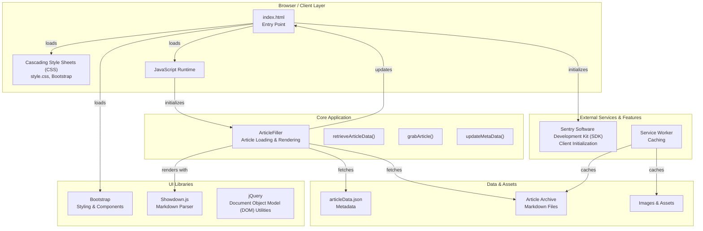
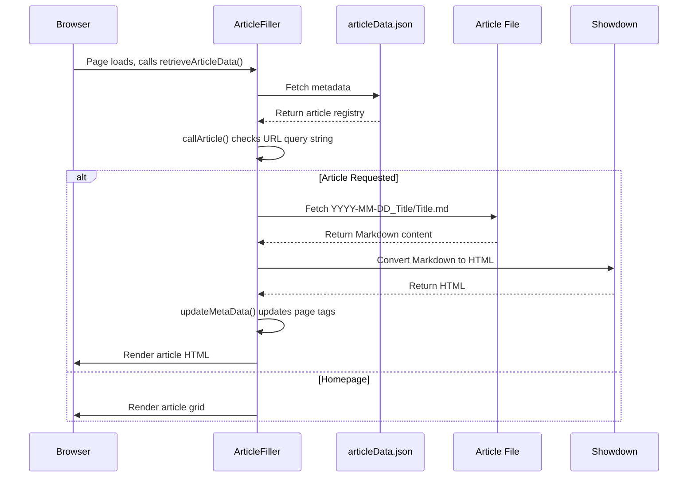

# System Architecture

Small Dev Talk is a client-side static web application that loads article metadata and content on-demand. A service worker precaches assets and applies runtime caching rules for images.

## Architecture Overview



## Core Components

### 1. Application Entry Point: [index.html](../../index.html)

The single Hypertext Markup Language (HTML) document that serves as the application shell. Key responsibilities:

- Meta tag configuration (Search Engine Optimization (SEO), Open Graph, Twitter Card, security headers)
- Script and stylesheet loading
- Document Object Model (DOM) structure with placeholders for dynamic content:
    - `#featuredArticles` — Homepage featured articles section
    - `#displayArticles` — Full article grid
    - `#articleBody` — Individual article container
- Sentry Software Development Kit (SDK) initialization

Implementation: [index.html](../../index.html)

### 2. Core Logic: [ArticleFiller Class](./../../src/scripts/index.js)

The `ArticleFiller` class is the central orchestrator for loading, rendering, and displaying articles.

**Key Responsibilities:**

- **Data Retrieval:** Fetches `articleData.json` to build the article registry
- **Page Retrieval:** Fetches legacy page definitions to drive carousel and featured lists
- **Article Loading:** Retrieves Markdown files based on article name and author
- **Rendering:** Converts Markdown to Hypertext Markup Language (HTML) using Showdown.js
- **Meta Tagging:** Updates page title, Open Graph, Twitter Card, and structured data
- **Error Handling:** Displays user-facing error output when content fails to load

**State Management:**

Static class properties maintain:

- `articleData` — Complete article metadata registry
- `articleMd` — Raw Markdown content of the current article
- `article` — Rendered HTML content
- `pageData` — Legacy page definitions
- `pageURL` — Parsed query tokens
- `callPageDisplay` — Flag for page display logic
- `whatPageDisplay` — Current view state (for example, "index" or a page category)
- `errMsg` — Error message display

Implementation: [src/scripts/index.js](../../src/scripts/index.js)

### 3. Data Layer: [Article Metadata](../../src/articleArchive/articleData.json)

A JavaScript Object Notation (JSON) file containing metadata for all published articles:

```json
{
	"ArticleTitle": {
		"title": "Full Article Title",
		"summary": "Brief description",
		"author": "Author Name",
		"date": "YYYY-MM-DD",
		"thumbnail": "filename.jpg"
	}
}
```

**Metadata Fields:**

| Field       | Type   | Used by                                      | Notes                                                          |
| ----------- | ------ | -------------------------------------------- | -------------------------------------------------------------- |
| `title`     | string | Metadata updates and list rendering          | Display title for listings and page metadata                   |
| `summary`   | string | Carousel and featured list rendering         | Displayed when the article is included in these lists          |
| `author`    | string | Article path construction and list rendering | Used to build `author{AuthorNameNoSpaces}`                     |
| `date`      | string | Article path construction and list rendering | Used to build `YYYY-MM-DD_{ArticleKey}`                        |
| `thumbnail` | string | List rendering and metadata image updates    | Used for carousel, featured list, archive, and social metadata |

Implementation: [src/scripts/index.js](../../src/scripts/index.js)

### 4. Article Storage: [Archive Directory](../../src/articleArchive/)

Directory structure follows a consistent pattern organized by author:

```text
src/articleArchive/
├── articleData.json
├── authorAlexanderSullivan/
│   ├── YYYY-MM-DD_ArticleTitle/
│   │   ├── ArticleTitle.md
│   │   ├── image1.jpg
│   │   ├── image2.jpg
│   │   └── ...
│   └── ...
├── authorJeffCen/
│   └── ...
└── authorNeilRampone/
    └── ...
```

**Important:** The key name in `articleData.json` must match the folder name exactly (case-sensitive, no spaces).

Implementation: [src/scripts/index.js](../../src/scripts/index.js)

### 5. Service Worker & Caching: [Service Worker Module](../../src/serviceWorker/sw.js)

Managed by Workbox, the service worker provides:

- **Precaching:** Assets under `./src` matching the configured glob patterns
- **Cache-First Strategy:** Images use a cache-first approach with a 10-item limit

The service worker is regenerated by running `npm run workbox`.

Implementation: [workbox-config.js](../../workbox-config.js), [src/serviceWorker/sw.js](../../src/serviceWorker/sw.js), [package.json](../../package.json)

## Data Flow: Article Loading

The flow below uses the Uniform Resource Locator (URL) query string to decide whether to render an article or a page view.



Implementation: [src/scripts/index.js](../../src/scripts/index.js)

## Navigation & URL Structure

Small Dev Talk uses **Uniform Resource Locator (URL) query parameters** for client-side navigation:

| URL                   | Purpose                                            |
| --------------------- | -------------------------------------------------- |
| `/?` or `/index.html` | Homepage with article grid                         |
| `/?ArticleTitle`      | Display single article                             |
| `/?pages&archive`     | Display archive view                               |
| `/?pages&{category}`  | Display carousel and featured lists for a category |

**Example:**

- `smalldevtalk.net/?Playsets` → Loads the "Playsets" article
- `smalldevtalk.net/?Caravaneer2` → Loads the "Caravaneer 2" article

Article names in the URL are converted to match the key in `articleData.json` (spaces removed, first letter of each segment uppercased).

Implementation: [src/scripts/index.js](../../src/scripts/index.js)

## Related Documentation

- [Data Flow](./data-flow.md)
- [ArticleFiller API](../api/article-filler.md)
