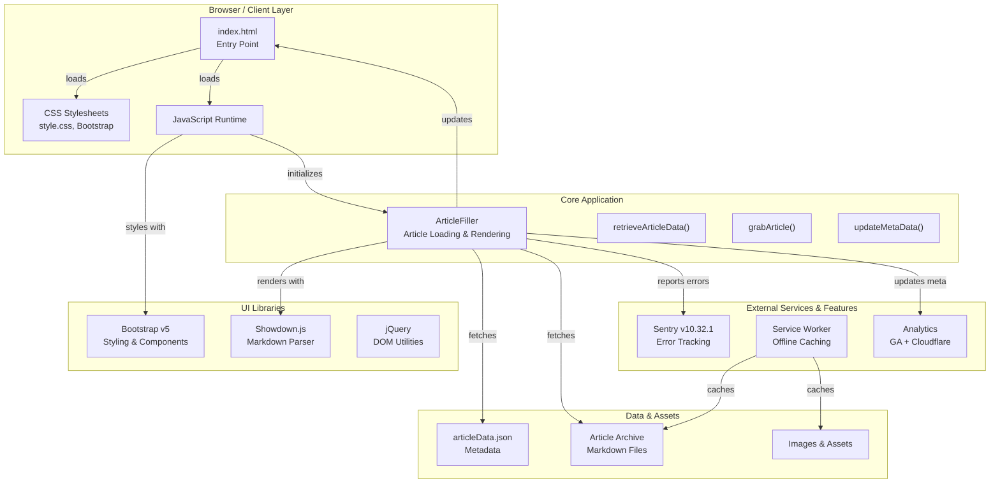

# System Architecture

Small Dev Talk is a client-side static web application that loads article metadata and content on-demand. The architecture prioritizes offline availability through service workers and progressive caching.

## Architecture Overview



## Core Components

### 1. Application Entry Point: [index.html](../../index.html)

The single HTML document that serves as the application shell. Key responsibilities:

- Meta tag configuration (SEO, Open Graph, Twitter Card, security headers)
- Script and stylesheet loading
- DOM structure with placeholders for dynamic content:
    - `#featuredArticles` — Homepage featured articles section
    - `#displayArticles` — Full article grid
    - `#articleBody` — Individual article container
- Sentry initialization and error tracking setup
- Service worker registration

### 2. Core Logic: [ArticleFiller Class](./../../src/scripts/index.js)

The `ArticleFiller` class is the central orchestrator for loading, rendering, and displaying articles. See [ArticleFiller API documentation](../api/article-filler.md) for detailed method signatures.

**Key Responsibilities:**

- **Data Retrieval:** Fetches `articleData.json` to build the article registry
- **Article Loading:** Retrieves markdown files based on article name and author
- **Rendering:** Converts markdown to HTML using Showdown.js
- **Meta Tagging:** Dynamically updates page title, Open Graph, Twitter Card, and structured data
- **Error Handling:** Displays user-friendly error messages when content fails to load

**State Management:**

Static class properties maintain:

- `articleData` — Complete article metadata registry
- `articleMd` — Raw markdown content of the current article
- `article` — Rendered HTML content
- `whatPageDisplay` — Current view state (e.g., "index", article name)
- `errMsg` — Error message display

### 3. Data Layer: [Article Metadata](../../src/articleArchive/articleData.json)

A JSON file containing metadata for all published articles:

```json
{
	"ArticleTitle": {
		"title": "Full Article Title",
		"summary": "Brief description",
		"author": "Author Name",
		"date": "YYYY-MM-DD",
		"thumbnail": "filename.jpg"
	}
}
```

**Metadata Fields:**

| Field       | Type   | Required | Description                               |
| ----------- | ------ | -------- | ----------------------------------------- |
| `title`     | string | Yes      | Display title for the article             |
| `summary`   | string | No       | Brief summary for listings                |
| `author`    | string | Yes      | Author name (must match folder structure) |
| `date`      | string | Yes      | Publication date (YYYY-MM-DD format)      |
| `thumbnail` | string | No       | Filename of the thumbnail image           |

### 4. Article Storage: [Archive Directory](../../src/articleArchive/)

Directory structure follows a consistent pattern organized by author:

```text
src/articleArchive/
├── articleData.json
├── authorAlexanderSullivan/
│   ├── YYYY-MM-DD_ArticleTitle/
│   │   ├── ArticleTitle.md
│   │   ├── image1.jpg
│   │   ├── image2.jpg
│   │   └── ...
│   └── ...
├── authorJeffCen/
│   └── ...
└── authorNeilRampone/
    └── ...
```

**Important:** The key name in `articleData.json` must match the folder name exactly (case-sensitive, no spaces).

### 5. Service Worker & Caching: [Service Worker Module](../../src/serviceWorker/sw.js)

Managed by Workbox, the service worker provides:

- **Precaching:** Articles, images, and assets are cached on first load
- **Cache-First Strategy:** Images use cache-first approach with 10-item limit
- **Offline Support:** Users can browse cached articles without internet
- **Updated via:** [workbox-config.js](../../workbox-config.js)

**Note:** Service workers are regenerated during build via the `npm run workbox` script.

### 6. Error Tracking: [Sentry Integration](../../index.html#L122-L145)

Sentry v10.32.1 is integrated for production error monitoring:

- **Configuration:**
    - DSN: Sentry project DSN (configured in index.html)
    - Tracing enabled (1.0 sample rate in development)
    - Session replay: 10% of sessions, 100% of error sessions
    - Console error capture: Enabled via `enableLogs: true`

- **Behavior:** Errors are captured and sent to Sentry for analysis and alerting

See [Sentry Integration](../api/sentry.md) for configuration details.

## Data Flow: Article Loading


## Navigation & URL Structure

Small Dev Talk uses **URL query parameters** for client-side navigation:

| URL                          | Purpose                         |
| ---------------------------- | ------------------------------- |
| `/?` or `/index.html`        | Homepage with article grid      |
| `/?ArticleTitle`             | Display single article          |
| `/?ArticleTitle&param=value` | (Additional parameters ignored) |

**Example:**

- `smalldevtalk.net/?Playsets` → Loads the "Playsets" article
- `smalldevtalk.net/?Caravaneer2` → Loads the "Caravaneer 2" article

Article names in the URL are converted to match the key in `articleData.json` (spaces removed, capitalized).
